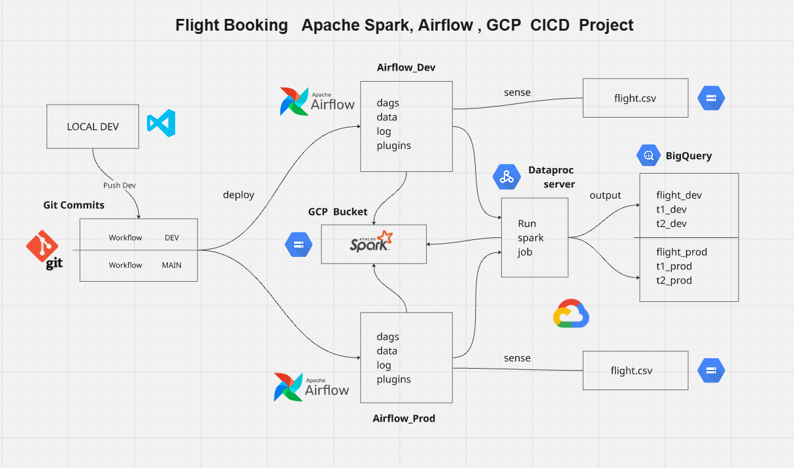

# Flight-Booking-Data-Ingestion-CICD
# 📌 Flight Booking Data Ingestion CICD  

## 📖 Overview  
This project demonstrates a **data ingestion and transformation pipeline** using:  
- **GitHub Actions** for CI/CD  
- **Apache Airflow (Cloud Composer on GCP)** for orchestration  
- **Apache Spark (Dataproc Serverless)** for data processing  
- **Google Cloud Storage (GCS)** for raw and intermediate data  
- **Google BigQuery** for storage and analytics  

The pipeline automates deployment, monitors new data arrivals, processes flight booking data, and generates insights for analysis.  

---

## 🖼️ Project Diagram  

  

---

## 🚀 Architecture  

### Workflow  
1. **GitHub Workflow (CI/CD)**  
   - Push to `dev` branch → Deploys to **Airflow_Dev**  
   - Push to `main` branch → Deploys to **Airflow_Prod**  
   - Uploads Airflow DAGs, variables, and Spark jobs to GCP  

2. **Airflow DAG (Orchestration using Cloud Composer)**  
   - Runs on **Google Cloud Composer**, a managed Airflow service.  
   - Senses the presence of the `flight.csv` file in Cloud Storage.  
   - Submits a Dataproc Serverless Spark job once the file is available.  

3. **Dataproc Serverless (Processing Layer)**  
   - Runs a PySpark job without needing cluster management.  
   - Reads the raw flight data from Cloud Storage.  
   - Applies transformations and generates insights.  
   - Writes output directly into BigQuery.  

4. **Google Cloud Storage (Data Lake)**  
   - Stores raw input data (`flight.csv`).  
   - Stores deployed artifacts such as Spark job scripts and Airflow variable files.  

5. **Google BigQuery (Data Warehouse)**  
   - Stores the processed and transformed data.  
   - Provides analytical tables for downstream BI and reporting.  
   - Separate tables for **dev** and **prod** environments to ensure safe testing.  

---

## 🗂 Project Structure  

```bash
├── .github/workflows/
│   └── flight_booking_cicd.yml      # GitHub Actions workflow
├── airflow_job/
│   └── airflow_job.py               # Airflow DAG (Dataproc trigger)
├── spark_job/
│   └── spark_transformation_job.py  # PySpark job for transformations
├── variables/
│   ├── dev/variables.json           # Airflow variables for DEV
│   └── prod/variables.json          # Airflow variables for PROD
└── README.md                        # Project documentation
